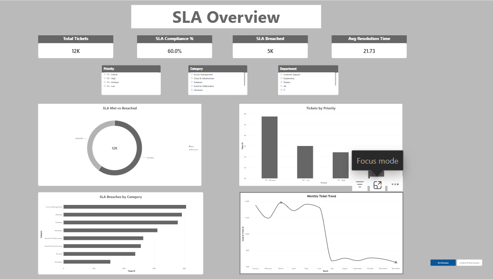
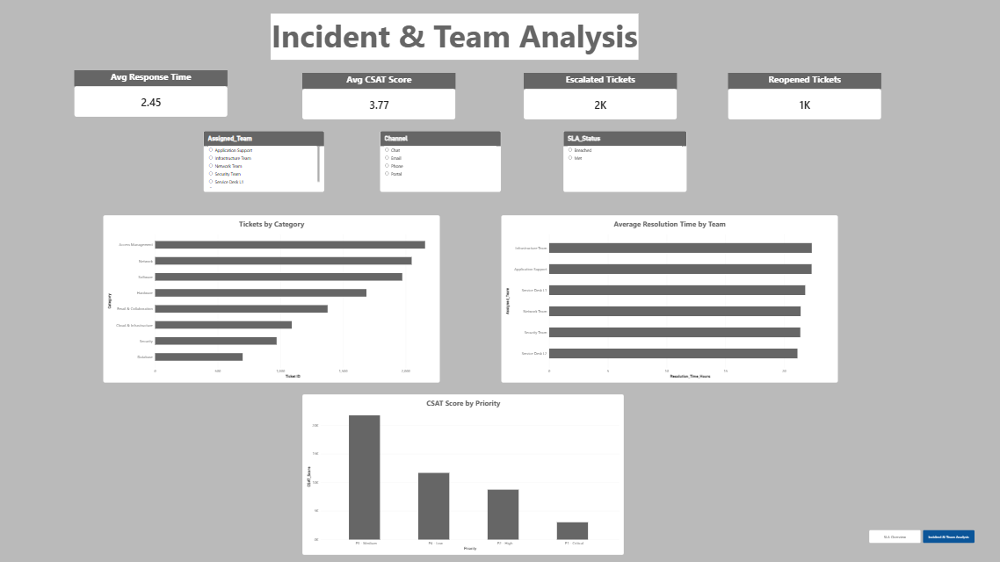

# IT Service Desk SLA & Incident Analytics

## 📌 Project Overview

The **IT Service Desk SLA & Incident Analytics** project analyzes IT service desk tickets to understand SLA performance, incident patterns, response and resolution times, and support team performance.

The project focuses on identifying SLA breach patterns across different priority levels and incident categories and provides insights that can support staffing and process improvement decisions.

The analysis was performed using **SQL, Python, and Power BI**.

---

## 🎯 Business Objective

The main objectives of this project are to:

- Measure overall SLA compliance.
- Identify SLA breach patterns across priority levels.
- Analyze SLA breaches by incident category.
- Evaluate response and resolution times.
- Analyze support team performance.
- Identify high-volume incident categories.
- Analyze customer satisfaction across priorities.
- Identify areas where staffing or support processes can be improved.

---

## 📊 Dataset

The project uses a **synthetic IT service desk dataset** containing:

- 12,000 ticket records
- 25 attributes
- Ticket information
- Priority and category details
- Response and resolution times
- SLA status
- Assigned team and agent
- Escalation and reopening information
- Customer satisfaction scores

### Key Columns

- Ticket_ID
- Created_Date
- First_Response_Date
- Resolved_Date
- Priority
- Category
- Sub_Category
- Department
- Assigned_Team
- Assigned_Agent
- Channel
- Status
- SLA_Target_Hours
- Response_Time_Hours
- Resolution_Time_Hours
- Response_SLA_Breached
- Resolution_SLA_Breached
- Escalated
- Reopened
- CSAT_Score
- SLA_Status

---

## 🛠️ Tools & Technologies

### SQL
- MySQL
- Aggregations
- GROUP BY
- CASE statements
- SLA calculations
- Performance analysis

### Python
- Pandas
- NumPy
- Matplotlib
- Seaborn
- Exploratory Data Analysis

### Power BI
- KPI Cards
- Slicers
- Donut Charts
- Bar Charts
- Column Charts
- Line Charts
- DAX Measures
- Interactive Dashboard

### Development Tools
- Jupyter Notebook
- MySQL Workbench
- Power BI Desktop
- Git
- GitHub
- VS Code

---

## 🔄 Project Workflow

```text
Synthetic Dataset
       ↓
Data Cleaning & Validation
       ↓
MySQL Database
       ↓
SQL Analysis
       ↓
Python EDA
       ↓
Power BI Dashboard
       ↓
Business Insights
       ↓
Recommendations


# 📈 SQL Analysis

The following analyses were performed using MySQL:

1. Overall SLA Performance
2. SLA Performance by Priority
3. SLA Performance by Category
4. Response & Resolution Performance by Category
5. Support Team Performance
6. Monthly SLA Trend
7. Top Problem Areas

---

# 🐍 Python Analysis

Python was used for exploratory data analysis and visualization.

The analysis included:

- Dataset inspection
- Data type validation
- Missing value analysis
- Duplicate validation
- Statistical summary
- SLA compliance analysis
- Priority-level analysis
- Category-level analysis
- Resolution time analysis

---

# 📊 Power BI Dashboard

The Power BI dashboard contains two pages.

## Page 1 — SLA Overview

### KPI Cards

- Total Tickets
- SLA Compliance %
- SLA Breached
- Average Resolution Time

### Slicers

- Priority
- Category
- Department

### Visualizations

- SLA Met vs Breached
- Tickets by Priority
- SLA Breaches by Category
- Monthly Ticket Trend

---

## Page 2 — Incident & Team Analysis

### KPI Cards

- Average Response Time
- Average CSAT Score
- Escalated Tickets
- Reopened Tickets

### Slicers

- Assigned Team
- Channel
- Status

### Visualizations

- Tickets by Category
- Average Resolution Time by Team
- CSAT Score by Priority

---

## 📸 Dashboard Preview

### SLA Overview



### Incident & Team Analysis



# 💡 Key Business Questions

This project answers questions such as:

- What percentage of tickets meet the SLA?
- Which priority level has the highest SLA breach rate?
- Which incident categories generate the most SLA breaches?
- Which categories have longer resolution times?
- Which support teams have higher resolution times?
- How does customer satisfaction vary by priority?
- Which incident areas may require additional staffing or process improvements?

---

# 📁 Project Structure

```text
IT Service Desk SLA Analytics/
│
├── excel/
│   └── IT_Service_Desk_SLA_Cleaned_No_Missing_12000.csv
│
├── python/
│   └── service_desk_analysis.ipynb
│
├── power bi/
│   └── IT Service Desk SLA Analytics.pbix
│
├── sql/
│   └── service_desk_analysis.sql
│
├── Visualizations/
│
├── raw data/
│
├── presentation/
│
├── report/
│
├── README.md
└── .gitignore


## 🚀 Project Outcome
The project provides an interactive analytical view of IT service desk operations by combining SLA compliance, incident volume, response time, resolution time, team performance, and customer satisfaction.
The insights can be used to identify operational bottlenecks and support decisions related to staffing, ticket prioritization, and service desk process improvements.

## 👩‍💻 Author
Rinshitha Shirin K
Data Analyst | SQL | Python | Power BI | Excel
```